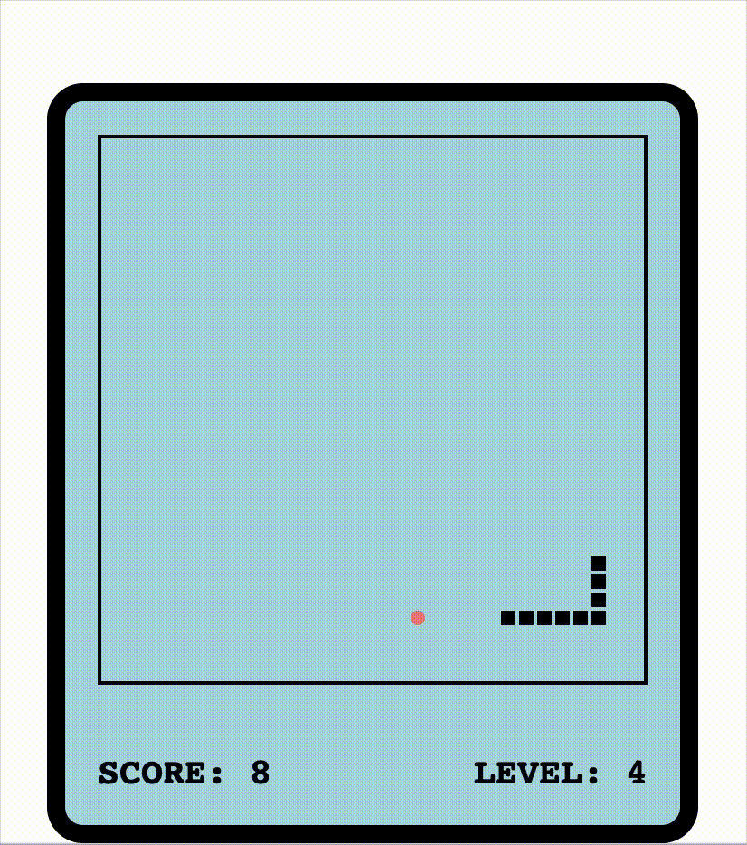

# GreedySnake

This is a small game project built with TypeScript using object-oriented programming principles, just for fun. The project is configured with Webpack for automatic bundling, along with loaders for TypeScript and LESS.

webpage: https://986913.github.io/GreedySnake/

To run the project locally, please execute: `npm install`

